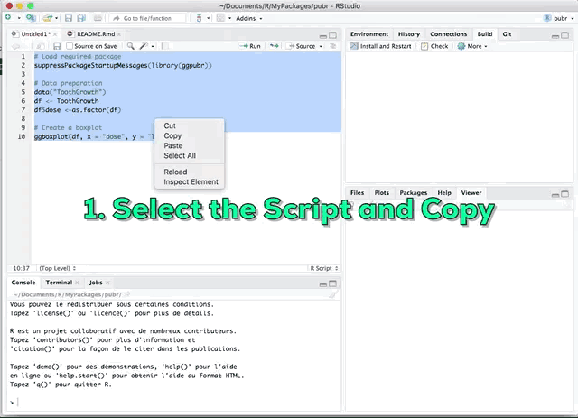
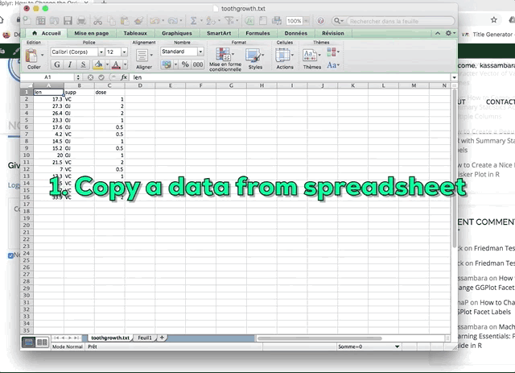
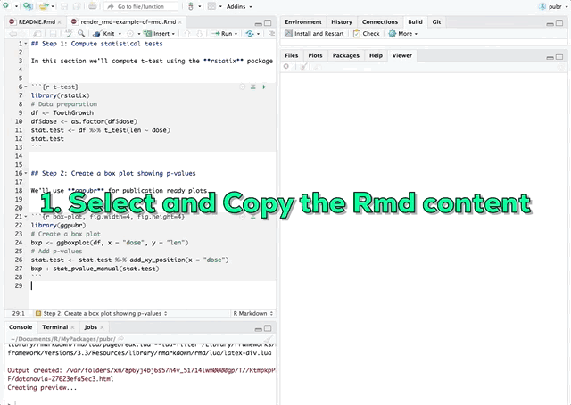

<!-- README.md is generated from README.Rmd. Please edit that file -->

```{r, include = FALSE}
knitr::opts_chunk$set(
  collapse = TRUE,
  comment = "#>",
  fig.path = "man/figures/README-",
  out.width = "100%"
)
```

# pubr: Publish Reproducible Examples from R to the Web


The goal of pubr is to convert reproducible R scripts and Rmd contents into a publishable HTML block. It makes it easy to share reproducible R code in (wordpress) website comments and blog posts.

## Installation and Loading
   
   
Install the `pubr` package:
   
```{r, eval = FALSE}
if(require(devtools)) install.packages("devtools")
devtools::install_github("kassambara/pubr")
```
   
   
Load the package:
   
   
```{r, eval = FALSE}
library("pubr")
```
  
  
Note that, if you are using Rstudio on linux, make sure you have installed the following system dependencies that make it easy to interact with clipboard: `xclip` or `xsel`. This can be installed using for example `apt-get install xclip` in bash terminal.
  
  
   
## Example 1: Reproducible R script using R built-in data


1. Write a pure R script in Rstudio
2. Select and copy the script
3. Run `pubr::render_r()`. The output of the rendered R script is a HTML block, which is automatically copied into the clipboard.
4. Paste into a website comment areas or into a blog post
     

```{r ex-1, fig.width=3, fig.height=3, eval = FALSE}
# Load required package
suppressPackageStartupMessages(library(ggpubr))

# Data preparation
data("ToothGrowth")
df <- ToothGrowth
df$dose <-as.factor(df)

# Create a boxplot
ggboxplot(df, x = "dose", y = "len")
```
    
    

  
  
## Example 2: Reproducible R script using data from clipboard


1. Write a pure R script in Rstudio
2. Copy the data from an Excel spreadsheet and paste it into R using the function `pubr::paste_data()`
3. Select and copy the script
4. Run `pubr::render_r()`. The output of the rendered R script is a HTML block, which is automatically copied into the clipboard.
5. Paste into a website comment area or into a blog post


```{r ex-2, fig.width=3, fig.height=3, eval = FALSE}
# Data preparation
df <- pubr::paste_data()

# Summary statistics
summary(df)
```





## Example 3: Reproducible R script using external data file


1. Write a pure R script in Rstudio
2. Paste your data into R using the function `pubr::paste_data(data_file)`
3. Select and copy the script
4. Run `pubr::render_r()`. The output of the rendered R script is a HTML block, which is automatically copied into the clipboard.
5. Paste into a website comment area or into a blog post


```{r ex-3, fig.width=3, fig.height=3, eval = FALSE}
# Data preparation
data_file <-system.file("demo_data", "toothgrowth.txt", package = "pubr")
df <- pubr::paste_data(data_file)

# Create a boxplot
summary(df)
```
   
   
## Example 4: Render a reproducible Rmd 
   
   
1. Write an Rmd (without yaml header) from Rstudio
2. Select and copy the Rmd content
4. Run `pubr::render_rmd()`. The output of the rendered Rmd content is a HTML block, which is automatically copied into the clipboard.
5. Paste into a website comment area or into a blog post
   
   



